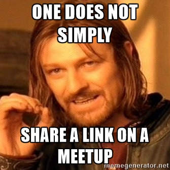

class: center, middle

# Ember Components

Erick Ruiz de Chavez

@eruizdechavez (GitHub, Twitter)

fb.me/erickruizdechavez

---

# Que es un componente?

- Template supercargado?
- Partial en esteroides?

--

**Not really.**

De la guía de Ember:

> Mientras que un template define la forma en que se ve la interfaz de usuario, un componente controla como se comporta la interfaz de usuario.

Un componente es la suma de dos elementos: un template que define la presentación y un archivo js que define la lógica de la misma.

---

# Como se hace un componente?

--

```sh
$ ember generate component mi-componente
```

**Nota**: Los componentes deben tener al menos un guion `-` en su nombre.

--

```sh
installing component
  create app/components/mi-componente.js
  create app/templates/components/mi-componente.hbs
installing component-test
  create tests/integration/components/mi-componente-test.js
```

--

No siempre tenemos que usar ambos archivos (`hbs`, `js`).

???

Habrá veces que solo necesitemos extender la funcionalidad de otro componente para evitar repetirnos constante mente (por lo cual no necesitaremos usar el template); En otras ocasiones y gracias a las muchas novedades en Ember 2, solo necesitaremos usar el template.

---

# Personalizando nuestro componente

--

- `tagName`
- `classNames`
- `classNameBindings`
- `attributeBindings`

---

# Componentes dinámicos

Y que pasa si queremos usar un componente que usa otros componentes de forma arbitraria? Para eso usamos el helper  `{{component}}`. Con el, podemos llamar cualquier componente por nombre y pasar los atributos que necesitemos.

--

Asumiendo `foo='mi-componente'`:

```hbs
{{component foo bar="baz"}}
```
--

Es equivalente a:

```hbs
{{mi-componente bar="baz"}}
```

---

layout: true

# Ciclo de vida de un componente

---

--

- `init`
- `didReceiveAttrs`
- `didInsertElement`
- `didRender`
- `willDestroyElement`

---

**Usando un Computed Property**

```js
import Ember from 'ember';

export default Ember.Component.extend({
  usuario: null,
  nombreCompleto: '',

*  nombreCompleto: Ember.computed('usuario.nombre', 'usuario.apellido', function() {
*    const nombre = this.get('usuario.nombre');
*    const apellido = this.get('usuario.apellido');
*
*    return `${nombre} ${apellido}`;
*  }),

});
```
---

**Usando didReceiveAttrs**

```js
import Ember from 'ember';

export default Ember.Component.extend({
  usuario: null,
  nombreCompleto: '',

*  didReceiveAttrs() {
*    this._super(...arguments);
*
*    const nombre = this.get('usuario.nombre');
*    const apellido = this.get('usuario.apellido');
*
*    this.set('nombreCompleto', `${nombre} ${apellido}`);
*  },

});
```

---

name: pasando-datos
layout: true

# Pasando datos a los componentes

---

Para que sean mas útiles los componentes necesitan recibir algún tipo de dato. Para esto tenemos dos formas: Atributos y posicionales.

---

**Atributos**

Tan fácil como pasar el nombre del atributo y su valor.

```hbs
{{mi-componente usuario=miUsuario}}
```

---

template: pasando-datos
name: pasando-datos-posicional
layout: true

**Posicional**

---

El orden de los parámetros **si** altera el producto

```hbs
{{mi-componente usuario}}
```

---

```js
import Ember from 'ember';

const MiComponente = Ember.Component.extend({
  nombreCompleto: '',

  didReceiveAttrs() {
    this._super(...arguments);

    const nombre = this.get('usuario.nombre');
    const apellido = this.get('usuario.apellido');

    this.set('nombreCompleto', `${nombre} ${apellido}`);
  },

});

*MiComponente.reopenClass({
*  positionalParams: ['usuario'],
*});

export default MiComponente;
```

---

layout: true

# Envolviendo contenido con un componente

---

Y que pasa cuando queremos simular un contenedor?

--

Usamos los componentes en forma de bloque y el helper `{{yield}}`

---

Dentro de nuestro componente:

```hbs
<div>
  
  
  <div>{{nombreCompleto}}</div>
  <div>{{usuario.nombreDeUsuario}}</div>
</div>
<div>
*  {{yield}}
</div>
```

---

Y fuera de el:

```hbs
{{#mi-componente usuario}}
*  <div>Últimos mensajes:</div>
*  <ul>
*    {{#each usuario.mensajes as |mensaje|}}
*      {{mi-mensaje usuario.nombre usuario.apellido mensaje}}
*    {{/each}}
*  </ul>
{{/mi-componente}}
```

---

layout: true

# Compartiendo datos hacia afuera

---

Este no es el único caso de uso de `{{yield}}` pues también podemos pasar datos hacia el bloque aunque este se encuentre fuera del contexto del componente. Estos datos se pueden pasar en la forma de un hash o, similar al componente, de forma posicional:

---

**Como hash**

Dentro de nuestro componente:

```hbs
{{yield (hash bar=bar baz=baz)}}
```

Y fuera de el:

```hbs
{{#mi-componente foo as |data|}}
*  {{data.bar}}
*  {{data.baz}}
{{/mi-componente}}
```

---

**Posicional**

Dentro de nuestro componente:

```hbs
{{yield bar baz)}}
```

Y fuera de el:

```hbs
{{#mi-componente foo as |bar baz|}}
*  {{bar}}
*  {{baz}}
{{/mi-componente}}
```

---

layout: false

# Events Everywhere!

https://guides.emberjs.com/v2.5.0/components/handling-events/#toc_event-names

--

.center[]

---

layout: true

# Acciones

---

**Básica**

En el template:

```hbs
{{mi-componente abrirPerfil="onAbrirPerfil"}}
```

Y en JavaScript:

```js
this.sendAction("abrirPerfil")
```

---

**Acción por nombre**

```hbs
{{mi-componente abrirPerfil=(action "onAbrirPerfil")}}
```

```js
this.get("abrirPerfil")();
```

---

**Acción por referencia**

En el template:

```hbs
{{mi-componente abrirPerfil=(action onAbrirPerfil)}}
```

Y en JavaScript:

```js
this.get("abrirPerfil")();
```

---

layout: false

# Recibiendo respuesta de una acción

En el template:

```hbs
{{mi-componente abrirPerfil=(action onAbrirPerfil)}}
```

En el JavaScript del parent:

```js
onAbrirPerfil() {
  return SuperCool.accionAsincrona();
}
```

Y en el JavaScript del componente:

```js
abrirPerfil() {
  this.get("abrirPerfil")().then(...);
}
```

---

name: mind-blown
layout: true

# Mind. Blown.

---

.center[]

---

template: mind-blown
layout: true

**Compartir acciones hacia afuera**

---

Nuestro componente:

```hbs
<div>
  
  
  <div>{{nombreCompleto}}</div>
  <div>{{usuario.nombreDeUsuario}}</div>
</div>
<div>
  {{yield
*    (hash
*      nombreCompleto=nombreCompleto
*      abrirMensaje=(action "abrirMensaje")
*    )
  }}
</div>
```

---

Uso externo:

```hbs
{{#mi-componente usuario as |compData|}}
  <div>Últimos mensajes:</div>
  <ul>
    {{#each usuario.mensajes as |mensaje|}}
      {{mi-mensaje
        compData.nombreCompleto
*        abrirMensaje=(action compData.abrirMensaje)
      }}
    {{/each}}
  </ul>
{{/mi-componente}}
```

---

template: mind-blown
layout: true

**Mut**

---

Sin `mut`:

En el template:

```hbs
<button onclick={{action "toggleUser"}}>
  {{if mostrarComponente "Ocultar" "Mostrar"}} Usuario
</button>

{{#if mostrarComponente}}
  {{mi-componente abrirPerfil=(action abrirPerfil)}}
{{/if}}
```

Y necesitamos un poco de JavaScript:

```js
toggleUser() {
  this.toggleProperty('mostrarComponente');
}
```

---

Con `mut`:

No mas funciones básicas para asignar!

```hbs
*<button onclick={{action (mut "mostrarComponente") (not mostrarComponente) }}>
  {{if mostrarComponente "Ocultar" "Mostrar"}} Usuario
</button>

{{#if mostrarComponente}}
  {{mi-componente abrirPerfil=(action abrirPerfil)}}
{{/if}}
```

---

layout: true

---
class: center, middle


---

class: center, middle

# Not really.

---

layout: false
class: center, middle

# Gracias

https://guides.emberjs.com/v2.5.0/

http://miguelcamba.com/blog/2016/01/24/ember-closure-actions-in-depth/
